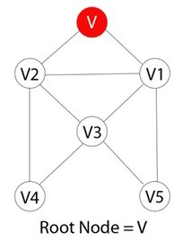
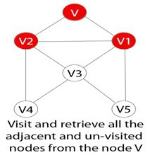

# Documentation

## BFS of graph

<a>&nbsp;&nbsp;&nbsp;&nbsp;&nbsp;&nbsp;&nbsp;&nbsp;&nbsp;&nbsp;&nbsp;&nbsp;&nbsp;&nbsp;
&nbsp;&nbsp;&nbsp;&nbsp;</a>

#### Problem Statement 
Given a directed graph. The task is to do Breadth First Search of this graph.

    Example 1:
    
    Input: 2
           5 4
           0 1 0 2 0 3 2 4
           3 2    
           0 1 0 2
           
    Output: 0 1 2 3 4    // BFS from node 0
            0 1 2  
    
#### Solution
  Step 1) 
         

  Each vertex or node in the graph is known. For instance, you can mark the node as V.

  Step 2) 
         

  In case the vertex V is not accessed then add the vertex V into the BFS Queue

  Step 3) 
         

  Start the BFS search, and after completion, Mark vertex V as visited.

  Step 4) 
         

  The BFS queue is still not empty, hence remove the vertex V of the graph from the queue.

  Step 5) 
         

  Retrieve all the remaining vertices on the graph that are adjacent to the vertex V

  Step 6) 
          

  For each adjacent vertex let's say V1, in case it is not visited yet then add V1 to the BFS queue

  Step 7) 
         

  BFS will visit V1 and mark it as visited and delete it from the queue.

##### Method-1      
###### CPP code
    #include <iostream>
    #include <list>

    using namespace std;

    class Graph {
       int numVertices;
       list<int>* adjLists;
       bool* visited;

      public:
       Graph(int vertices);
       void addEdge(int src, int dest);
       void BFS(int startVertex);
      };

      // Create a graph with given vertices,
     // and maintain an adjacency list
      Graph::Graph(int vertices) {
      numVertices = vertices;
      adjLists = new list<int>[vertices];
        }

    // Add edges to the graph
    void Graph::addEdge(int src, int dest) {
    adjLists[src].push_back(dest);
    adjLists[dest].push_back(src);
      }

       // BFS algorithm
     void Graph::BFS(int startVertex) {
     visited = new bool[numVertices];
     for (int i = 0; i < numVertices; i++)
     visited[i] = false;

     list<int> queue;

    visited[startVertex] = true;
    queue.push_back(startVertex);

    list<int>::iterator i;

    while (!queue.empty()) {
      int currVertex = queue.front();
      cout << "Visited " << currVertex << " ";
      queue.pop_front();

    for (i = adjLists[currVertex].begin(); i != adjLists[currVertex].end(); ++i) {
      int adjVertex = *i;
      if (!visited[adjVertex]) {
        visited[adjVertex] = true;
        queue.push_back(adjVertex);
        }
       }
     }
    }

     int main() {
     Graph g(4);
     g.addEdge(0, 1);
     g.addEdge(0, 2);
     g.addEdge(1, 2);
     g.addEdge(2, 0);
     g.addEdge(2, 3);
     g.addEdge(3, 3);

     g.BFS(2);

      return 0;
    }

##### Method-2
###### Python code
    import collections
    
    def bfs(graph, root):

    visited, queue = set(), collections.deque([root])
    visited.add(root)

    while queue:

        # Dequeue a vertex from queue
        vertex = queue.popleft()
        print(str(vertex) + " ", end="")

        # If not visited, mark it as visited, and
        # enqueue it
        for neighbour in graph[vertex]:
            if neighbour not in visited:
                visited.add(neighbour)
                queue.append(neighbour)

        if __name__ == '__main__':
        graph = {0: [1, 2], 1: [2], 2: [3], 3: [1, 2]}
        print("Following is Breadth First Traversal: ")
        bfs(graph, 0)
 
  ###### Time Complexity : O(V + E).
           where V is the number of nodes and E is the number of edges.
  ###### Space Complexity : O(V).
